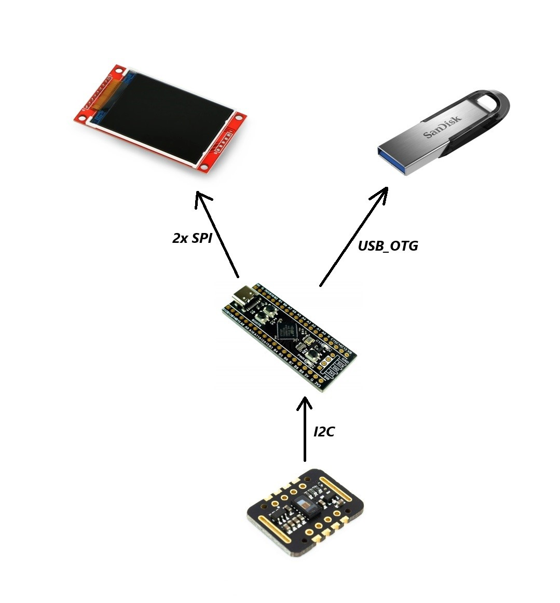
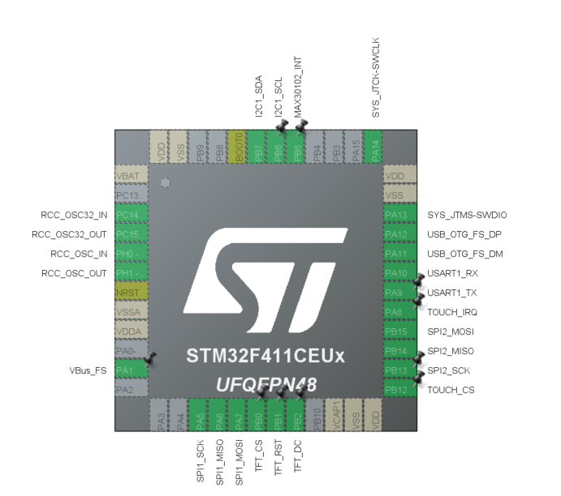

 # HomeEKG

*********** Work in progress **************

## Contents:
1. Discussion of the assumptions and goals of the project.
2. Project description
3. Hardware and development tool used
4. Environment configuration
5. Electrical diagram
6. Technical description of the project
7. 3D printing
8. Problems encountered and how to solve them
9. Secondary sources

## 1. Main goal
The main goal of the project was to expand skills in programming STM32 microcontrollers, using many additional components and coherently reconciling them with each other. An additional goal was to create a device useful on an everyday basis for people who need to monitor their pulse and blood oxygenation level.

## 2. Project description
The project involves building a device that will enable measuring the pulse and blood oxygenation level and recording the measured data on a portable device, e.g. a pendrive. Values measured using an appropriate sensor are displayed on the touch display along with the work log and the current time. It is possible to save measurements on an external device using a touch button on the display along with all data such as measurement time, etc.

## 3. Tools
Equipment used in the project:
- microcontroller - STM32F411CEU6 on the "Blackpill" development board
  [Documentation]([https://www.adres-strony.pl](https://www.st.com/en/microcontrollers-microprocessors/stm32f411ce.html))
  
- resistive display with ILI9341 controller and XPT2046 touch controller
- pulse and blood oxygenation sensor – MAX30102
-basic electronic components such as wires, resistors, capacitors, etc.
- USB socket

Additional tool used when creating work:
- logic analyzer
- laboratory power supply
- ST-LinkV2 programmer
- multimeter

IT tools:
- STM32CubeIDE environment
- STM32CubeProgrammer
- Logic
- Fusion 360

## 4. Environment configuration

